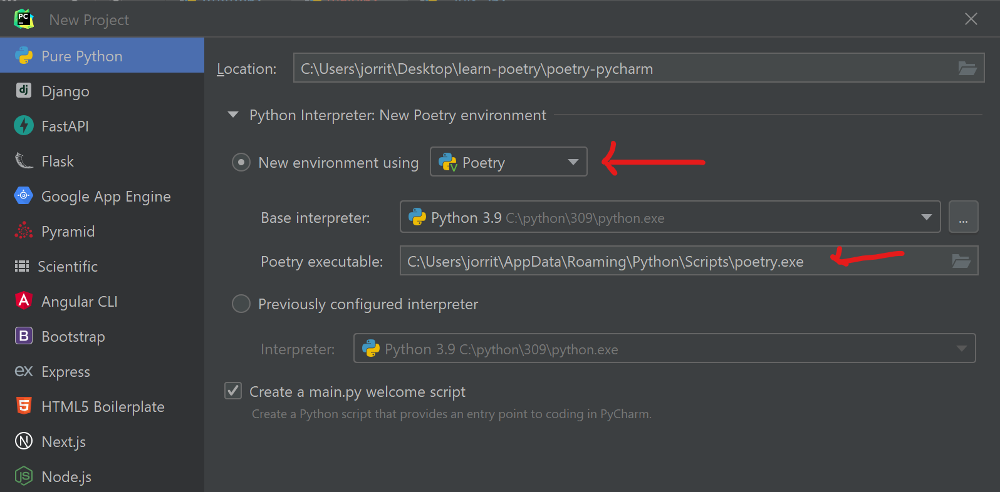
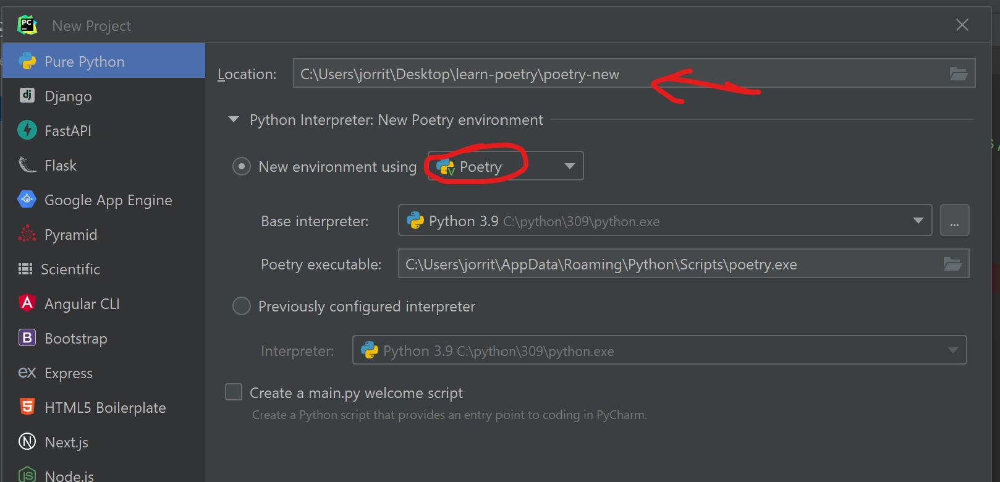

# Learn poetry

- [Learn poetry](#learn-poetry)
  - [Purpose](#purpose)
  - [Structuring a python package project using poetry or cookiecutter](#structuring-a-python-package-project-using-poetry-or-cookiecutter)
    - [Flat versus src layout](#flat-versus-src-layout)
    - [Poetry setup](#poetry-setup)
    - [Poetry-pycharm](#poetry-pycharm)
    - [Poetry-new](#poetry-new)
    - [Poetry-new-src](#poetry-new-src)
    - [poetry-cookie](#poetry-cookie)
  - [adding dependencies](#adding-dependencies)
  - [developing and testing (installing in editable mode)](#developing-and-testing-installing-in-editable-mode)
  - [building a package](#building-a-package)
  - [installing a package from wheel](#installing-a-package-from-wheel)
  - [references](#references)


## Purpose
The purpose of this repo is to learn poetry for package management and package building. Different approaches are compared.

## Structuring a python package project using poetry or cookiecutter
### Flat versus src layout
A lot has been written on this topic:
* https://packaging.python.org/en/latest/discussions/src-layout-vs-flat-layout/
* https://py-pkgs.org/04-package-structure#the-source-layout

TLDR; the source layout has some advantages but requires the package to be installed (in editable mode) before you can use / test your code.


### Poetry setup
* `poetry` is best installed following [the official documentation guidelines](https://python-poetry.org/docs/#installation) instead of using pip. 
* `poetry` has its own virtual environments but uses a cache for this. I prefer to have my virtual environments inside my package folder:
```
C:\Users\jorrit>poetry config virtualenvs.in-project true

C:\Users\jorrit>poetry config --list
cache-dir = "C:\\Users\\jorrit\\AppData\\Local\\pypoetry\\Cache"
experimental.system-git-client = false
installer.max-workers = null
installer.modern-installation = true
installer.no-binary = null
installer.parallel = true
virtualenvs.create = true
virtualenvs.in-project = true   <--- this is better!
virtualenvs.options.always-copy = false
virtualenvs.options.no-pip = false
virtualenvs.options.no-setuptools = false
virtualenvs.options.system-site-packages = false
virtualenvs.path = "{cache-dir}\\virtualenvs"  # C:\Users\jorrit\AppData\Local\pypoetry\Cache\virtualenvs
virtualenvs.prefer-active-python = false
virtualenvs.prompt = "{project_name}-py{python_version}"
```

### Poetry-pycharm
Folder `poetry-pycharm` contains a project set up in pycharm.

[](doc/pycharm01.png)

This results in a very simple project structure.
If you want to do any package development you will have to add a lot of structure (e.g. the 'source'-layout) to this.
```
Folder PATH listing for volume Windows-SSD
Volume serial number is 6E8D-45D5
C:.
ª   main.py
ª   pyproject.toml
ª   
+---.idea
ª       ...
+---.venv
    ª   ... (contains the environment created by poetry)
```

Pycharm immediatly knows to use this venv in the terminal, or in the python console, as shown when printing the last entries of `sys.path`:
```
C:\Users\jorrit\Desktop\learn-poetry\poetry-new\.venv
C:\Users\jorrit\Desktop\learn-poetry\poetry-new\.venv\lib\site-packages
C:\Program Files\JetBrains\PyCharm 2023.1\plugins\python\helpers\pycharm_matplotlib_backend
C:\Users\jorrit\Desktop\learn-poetry\poetry-new
```
You can also start the poetry shell by typing
`poetry shell` 


### Poetry-new
Folder `poetry-new` contains a project set up with 
```
C:\Users\jorrit\Desktop\learn-poetry>poetry new poetry-new
Created package poetry_new in poetry-new
```
This structure is meant to start building a package BUT
* it uses the flat layout and not the source layout
* it has no venv set up from the start
```
Folder PATH listing for volume Windows-SSD
Volume serial number is 6E8D-45D5
C:.
ª   pyproject.toml
ª   README.md
ª   
+---poetry_new
ª       __init__.py
ª       
+---tests
        __init__.py     
```
You could add the venv when 'adding' the pycharm project.

[](doc/pycharm02.png)

Moving to a 'source'-layout manually also requires updates to the pyprojec.toml file so this is not advised (see next project).

### Poetry-new-src
There is an easy way to set up a python package project in source layout:
```
C:\Users\jorrit\Desktop\learn-poetry>poetry new --src poetry-new-src
Created package poetry_new_src in poetry-new-src
```
Indeed, this results in the desired layout.
```
Folder PATH listing for volume Windows-SSD
Volume serial number is 6E8D-45D5
C:.
│   pyproject.toml
│   README.md
│
├───src
│   └───poetry_new_src
│           __init__.py
│
└───tests
        __init__.py
```
Note that this project, like the previous one, does not come with a venv out of the box. However, the first time we install a package using `poetry add` this environment is immediatly created for us by poetry.
```
C:\Users\jorrit\Desktop\learn-poetry\poetry-new-src>poetry add requests
Creating virtualenv poetry-new-src in C:\Users\jorrit\Desktop\learn-poetry\poetry-new-src\.venv
Using version ^2.31.0 for requests

Updating dependencies
Resolving dependencies...

Package operations: 5 installs, 0 updates, 0 removals

  • Installing certifi (2023.7.22)
  • Installing charset-normalizer (3.2.0)
  • Installing idna (3.4)
  • Installing urllib3 (2.0.4)
  • Installing requests (2.31.0)

Writing lock file
```
In addition, this dependency is immediatly added to pyproject.toml
```
[tool.poetry]
name = "poetry-new-src"
version = "0.1.0"
description = ""
authors = ["Jorrit Vander Mynsbrugge <44178217+jorritvm@users.noreply.github.com>"]
readme = "README.md"
packages = [{include = "poetry_new_src", from = "src"}]

[tool.poetry.dependencies]
python = "^3.9"
requests = "^2.31.0"


[build-system]
requires = ["poetry-core"]
build-backend = "poetry.core.masonry.api"
```

Imagine that you 'remove' your entire .venv folder and want to reinstate it (e.g. after git checkout, with .venv in gitignore), you can do `poetry install`
```
C:\Users\jorrit\Desktop\learn-poetry\poetry-new-src>poetry install
Creating virtualenv poetry-new-src in C:\Users\jorrit\Desktop\learn-poetry\poetry-new-src\.venv
Installing dependencies from lock file

Package operations: 5 installs, 0 updates, 0 removals

  • Installing certifi (2023.7.22)
  • Installing charset-normalizer (3.2.0)
  • Installing idna (3.4)
  • Installing urllib3 (2.0.4)
  • Installing requests (2.31.0)

Installing the current project: poetry-new-src (0.1.0)
```

You can add your pycharm project, by selecting a 'new virtual poetry environment' without risk of overwriting/erasing any packages you might have added already.

### poetry-cookie
You can install cookiecutter into your system python installation
```
pip install cookiecutter
```

Scafolding a new project from the parent directory is done like this:
```
cookiecutter https://github.com/py-pkgs/py-pkgs-cookiecutter.git
```
after which you have to fill out the form:
```
C:\Users\jorrit\Desktop\learn-poetry>cookiecutter https://github.com/py-pkgs/py-pkgs-cookiecutter.git
You've downloaded C:\Users\jorrit\.cookiecutters\py-pkgs-cookiecutter before. Is it okay to delete and re-download it?
[y/n] (y):
  [1/8] author_name (Monty Python): Jorrit
  [2/8] package_name (mypkg): poetry-cookie
  [3/8] package_short_description (A package for doing great things!):
  [4/8] package_version (0.1.0):
  [5/8] python_version (3.9):
  [6/8] Select open_source_license
    1 - MIT
    2 - Apache License 2.0
    3 - GNU General Public License v3.0
    4 - CC0 v1.0 Universal
    5 - BSD 3-Clause
    6 - Proprietary
    7 - None
    Choose from [1/2/3/4/5/6/7] (1):
  [7/8] Select include_github_actions
    1 - no
    2 - ci
    3 - ci+cd
    Choose from [1/2/3] (1):

```
This provides you with a 'source-layout' that is preconfigured for package building, pytest, sphinx, poetry, ...
```
Folder PATH listing for volume Windows-SSD
Volume serial number is 6E8D-45D5
C:.
ª   .gitignore
ª   .readthedocs.yml
ª   CHANGELOG.md
ª   CONDUCT.md
ª   CONTRIBUTING.md
ª   LICENSE
ª   pyproject.toml
ª   README.md
ª   
+---docs
ª       changelog.md
ª       conduct.md
ª       conf.py
ª       contributing.md
ª       example.ipynb
ª       index.md
ª       make.bat
ª       Makefile
ª       requirements.txt
ª       
+---src
ª   +---poetry_cookie
ª           poetry_cookie.py
ª           __init__.py
ª           
+---tests
        test_poetry_cookie.py
```


## adding dependencies
you can add normal dependencies like this:
```
poetry add pkgname
```

and development dependencies like this:
```
poetry add --dev pkgname
```

## developing and testing (installing in editable mode)
A package is installed using `poetry install` .

If your project has a virtual environment, you can check whether your package is properly installed by looking in the .venv folder. There should be a meta data folder and a path file refering to the source code location.

```
C:\Users\jorrit\Desktop\learn-poetry\poetry_cookie\.venv\Lib\site-packages>dir
 Volume in drive C is Windows-SSD
 Volume Serial Number is 6E8D-45D5

 Directory of C:\Users\jorrit\Desktop\learn-poetry\poetry_cookie\.venv\Lib\site-packages

2023-08-21  20:45    <DIR>          .
2023-08-21  20:44    <DIR>          ..
...
2023-08-21  20:46    <DIR>          pluggy
2023-08-21  20:45    <DIR>          pluggy-1.2.0.dist-info
2023-08-21  20:44    <DIR>          poetry_cookie-0.1.0.dist-info  <---
2023-08-21  20:44                57 poetry_cookie.pth              <---
2023-08-21  20:45               263 py.py
2023-08-21  20:46    <DIR>          pytest
2023-08-21  20:45    <DIR>          pytest-7.4.0.dist-info
2023-08-21  20:44    <DIR>          setuptools
2023-08-21  20:44    <DIR>          setuptools-68.0.0.dist-info
2023-08-21  20:44                 0 setuptools-68.0.0.virtualenv
...
               8 File(s)          4.920 bytes
              27 Dir(s)  627.426.631.680 bytes free

C:\Users\jorrit\Desktop\learn-poetry\poetry_cookie\.venv\Lib\site-packages>type poetry_cookie.pth
C:/Users/jorrit/Desktop/learn-poetry/poetry_cookie/src
```
This means all source files using this .venv can now import `poetry_cookie` because it is found on `sys.path`.

Let's say we have written a piece of code and a test:
Code: src/poetry_cookie/poetry_cookie.py
```python
def give_me(x):
    return x
```

Test: tests/test_poetry_cookie.py
```python
from poetry_cookie import poetry_cookie

def test_give_me():
    assert poetry_cookie.give_me(5) == 5
    assert poetry_cookie.give_me(0.0) == 0.0
    assert poetry_cookie.give_me(True) == True
``` 
Then running pytest poses no problem:
```
(poetry-cookie-py3.9) PS C:\Users\jorrit\Desktop\learn-poetry\poetry_cookie> pytest
======================================================================= test session starts =======================================================================  
platform win32 -- Python 3.9.13, pytest-7.4.0, pluggy-1.2.0
rootdir: C:\Users\jorrit\Desktop\learn-poetry\poetry_cookie
collected 1 item                                                                                                                                                     
tests\test_poetry_cookie.py .                                                                                                                                [100%]  
======================================================================== 1 passed in 0.04s ======================================================================== 
```

## building a package
`poetry build` is a single command to convert your package into a sdist and a wheel
```
C:\Users\jorrit\Desktop\learn-poetry\poetry-new-src>poetry build
Building poetry-new-src (0.1.0)
  - Building sdist
  - Built poetry_new_src-0.1.0.tar.gz
  - Building wheel
  - Built poetry_new_src-0.1.0-py3-none-any.whl
```

The result is the creation of a dist/ folder:
```
Folder PATH listing for volume Windows-SSD
Volume serial number is 6E8D-45D5
C:.
ª   poetry.lock
ª   pyproject.toml
ª   README.md
ª   
+---.idea
ª       ...
+---.venv
ª       ...
+---dist
ª       poetry_new_src-0.1.0-py3-none-any.whl
ª       poetry_new_src-0.1.0.tar.gz
ª       
+---src
ª   +---poetry_new_src
ª           __init__.py
ª           
+---tests
        __init__.py
```

## installing a package from wheel
We now install this package from the wheel into the venv of the `poetry-pycharm` project and test it.

A simple pip install fixes that:
```
(poetry-pycharm-py3.9) PS C:\Users\jorrit\Desktop\learn-poetry\poetry-pycharm> pip install ..\poetry_cookie\dist\poetry_cookie-0.1.0-py3-none-any.whl
Processing c:\users\jorrit\desktop\learn-poetry\poetry_cookie\dist\poetry_cookie-0.1.0-py3-none-any.whl
Installing collected packages: poetry-cookie
Successfully installed poetry-cookie-0.1.0
```
Notice how we:
* are in the poetry-pycharm root
* have an active poetry .venv
* install the .whl and not the .tar.gz sdist.

All that is left to do is test it:
```python
# Press the green button in the gutter to run the script.
if __name__ == '__main__':
    print_hi('PyCharm')

    from poetry_cookie import poetry_cookie
    print(poetry_cookie.give_me(5)) 
```
returns:
```
C:\Users\jorrit\Desktop\learn-poetry\poetry-pycharm\.venv\Scripts\python.exe C:\Users\jorrit\Desktop\learn-poetry\poetry-pycharm\main.py 
Hi, PyCharm
5
```

## references
* https://packaging.python.org/en/latest/overview/
* https://py-pkgs.org/03-how-to-package-a-python
  